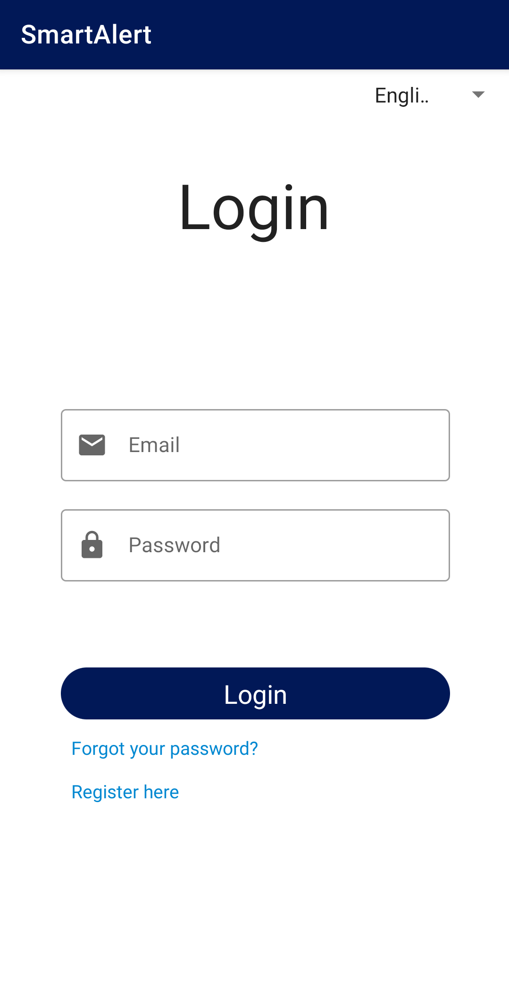
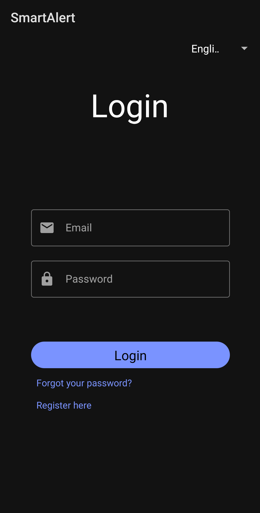
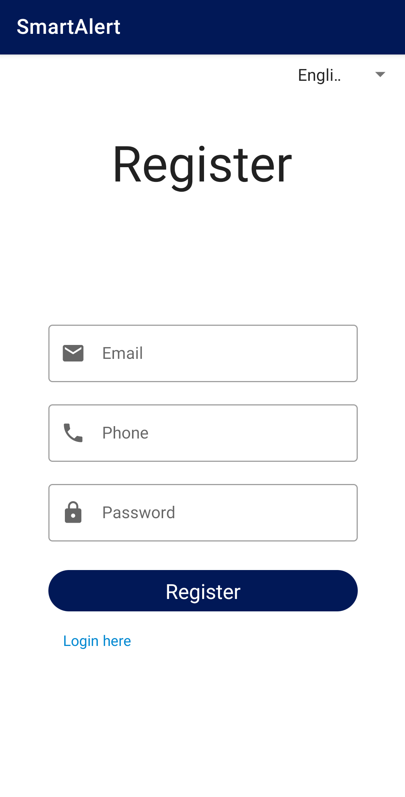
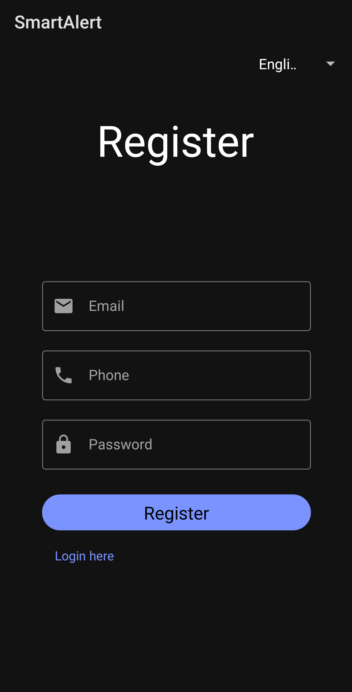
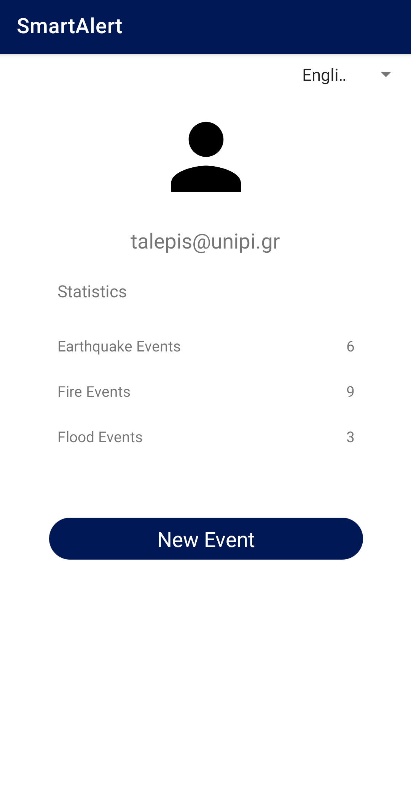
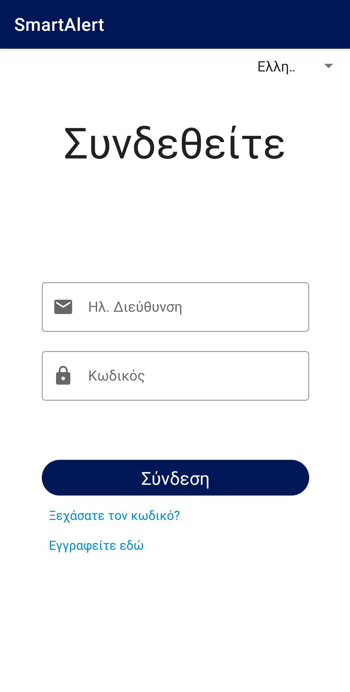
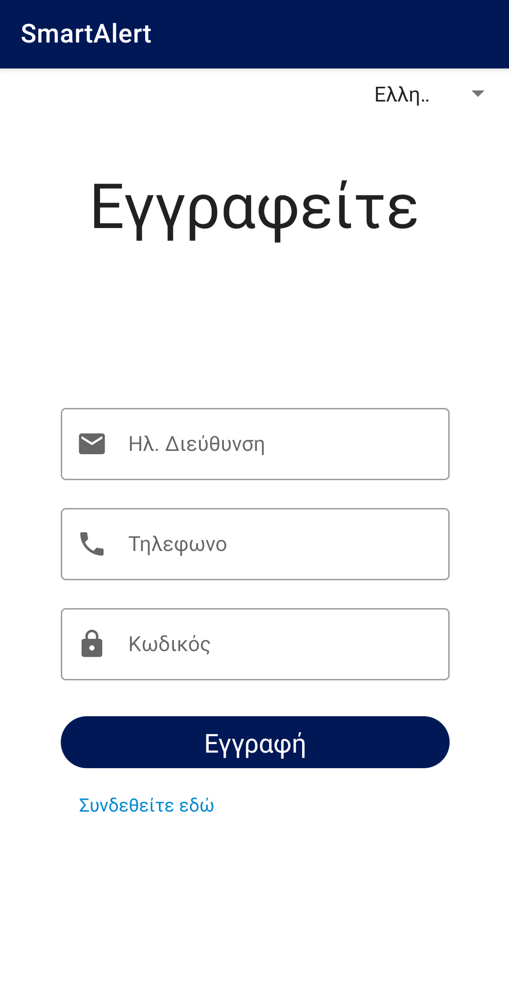

# Smart Alert Android

An Android app that enables civilians to report natural disasters in real-time, providing emergency responders with critical information to assess and respond to the situation. Users can quickly report the disaster's location, severity, and additional details, while also receiving real-time updates and alerts about new or ongoing disasters in their area. The app aims to help people respond to natural disasters quickly and potentially saving lives and minimizing damage.

## Features

- Light/dark mode
- Geo Location data
- Real time report system
- Authentication
- Multi-lingual support

## Screenshots

## Authors

- [@0x-2FA](https://www.github.com/0x-2FA)
- [@SophiaNikolia](https://github.com/SophiaNikolia)
- [@spentzaris](https://github.com/spentzaris)
